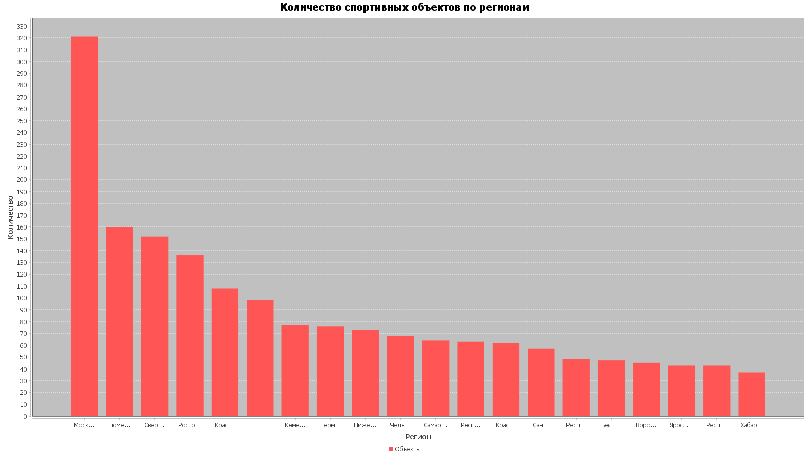

# java-sports-project

Семестровый проект «Sports»

## Вывод

```shell
Запуск анализа спортивных объектов...
Прочитано записей: 2896
Данные загружены в БД.

--- Результаты анализа ---
Среднее количество объектов спорта в регионе: 21.94

Топ-3 региона по количеству объектов:
- Москва и Московская обл.: 321
- Тюменская область: 160
- Свердловская область: 152

График сохранен в файл: .\sports_stats.png
```

<div align="center">
  
</div>

## Запуск

```shell
./gradlew run
```
